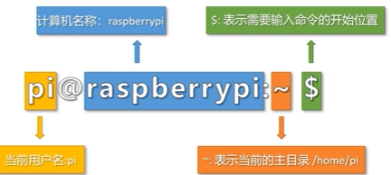

# 学习笔记

## 一、树莓派构成

ARM 1176JZF-S 700 MH单核处理器、256MB RAM、两个USB端口、HDMI、100MBPS以太网、GPIO接头、SD卡槽、USB供电

## 二、树莓派常用命令行

关机：

sudo raspi-config               # 系统配置界面

sudo rpi-update                 # 更新固件

sudo apt install raspi-gpio     # 安装GPIO工具

sudo command                     # 以管理员权限执行

chmod +x script.sh              # 添加执行权限

chown pi:pi file                # 更改文件所有者

ps aux                          # 查看所有进程

top                             # 实时进程监控

kill PID                        # 结束进程

sudo reboot                     # 重启系统

sudo shutdown -h now            # 立即关机

## 三、环境部署

### 系统烧录：

这里烧录之后SD卡中显示的内存并不是真正的内存。

### 首次开机：

1、需要的外设：显示屏、HDMI接线、树莓派专用电源接线、USB接线的鼠标和键盘。

2、设置用户名和用户密码。

### 无显示屏连接、网线远程连接：

1、两种关机方式：桌面图标和终端命令

2、共享网络——查找树莓派IP地址——利用树莓派IP地址连接树莓派（putty）

（由于我的电脑不支持连接网线，所以只学习了理论知识，并未实现）

### DRP远程连接控制树莓派：

控制端+网络（数据和信息的传递）+树莓派

1、在SD卡中配置信息（修改网络名称和密码）

2、查找树莓派的地址

3、在树莓派中安装xrdp

4、远程桌面连接

# 四、树莓派配置静态IP

#### 查看当前网络配置

查看树莓派当前的网络配置，包括IP地址、子网掩码、网关和DNS服务器信息。

#### 查找网关地址

使用 ip route  命令查看网关地址

#### 查找DNS服务器地址

resolvectl status wlan0

#### 编辑 Netplan 配置文件

列出/etc/netplan/ 目录下的文件，编辑对应的 Netplan 配置文件，修改配置文件，添加静态IP地址、网关和DNS服务器地址。

#### 应用配置

#### 验证配置

验证静态IP地址（ip a），验证 DNS 配置（resolvectl status wlan0）

# 五、文件传输

下载WinSCP软件，文件协议是SFTP。

# 六、配置python编译环境

树莓派命令行自带Python：    

输入Python，会有Python版本的提示，然后就可以使用了。退出输入exit（）。

树莓派自带Python编译软件：

点击树莓图标，选择编程，再选择Thonny。

# 七、配置C++编译环境

## 安装gpio库：

检查是否有gpio库，在树莓派命令行里输入gpio -v。若未找到命令。，则需安装，命令行内输入sudo dpkg -i wiringpi-latest.deb。安装wiringpi库，命令行内输入sudo dpkg -i wiringpi-latest.deb。安装完后，输入gpio -v。

# 八、Linux系统操作命令和编译器的使用

1、终端会话提示符：

超级用户名：root

2、常用终端命令：

​	pwd:显示当前所在目录

​	cd~:切换到主目录（/home/pi），~也可以省略不写

​	cd dir:切换到指定目录，dir表示文件路径

​	cd.. 切换到上一级目录

​	ls:展示当前目录下所有的文件和文件夹（不包含隐藏文件）

​	ls -a：展示当前目录下所以问价和文件夹（包含隐藏文件）

​	touch file:创建文件file

​	mkdir dir:创建目录dir

​	cat file:查看文件file里的内容

​	more file:查看文件file里的内容

​	head file:查看文件file前10行

​	tail file:查看文件file后10行

​	rm file #删除文件file

​	rm -r dir #删除目录dir

3、nano编译器：

​	nano file:使用Nano编辑文件file

​	ctrl+o：保存当前文件

​	esc+u:撤销上次操作

​	ctrl+u：粘贴

​	ctrl+g:打开Nano帮助文档

​	vi file:使用vi编辑文件file，若文件不存在，则创建文件file

# 九、串口通信点亮LED灯

1、选定GPIO引脚：cd/sys/class/gpio:进入GPIO目录

​				  ls：查看GPIO目录中的内容

​				  echo 引脚编码>export：GPIO 操作接口从内核空间暴露到用户空间，执行之后                   								             该目录下会增加一个引脚文件

#include <wiringPi.h>

#define Pin 25

int main()
{

​	if(wiringPiSetup() < 0)

​		return 1;

​	pinMode(Pin,OUTPUT);

​	for(int i=0;i<10;i+ +)
​	{

​		digitalWVrite(Pin,1);

​		delay (200);

​		digitalwrite(Pin,0);

​		delay (200);

​	}		

​	return 0;

}

2、串口通讯步骤：

​	1、准备待调试的硬件串口
​	2、安装minicom串口助手
​	3、电脑安装串口调试工具
​	4、使用USB转TTL工具连接电脑和树莓派，开始通讯
