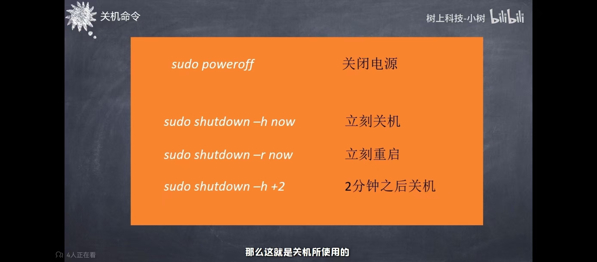

# 学习笔记

## 一、树莓派构成

ARM 1176JZF-S 700 MH单核处理器、256MB RAM、两个USB端口、HDMI、100MBPS以太网、GPIO接头、SD卡槽、USB供电

## 二、树莓派常用命令行

关机：

sudo raspi-config               # 系统配置界面
sudo rpi-update                 # 更新固件
sudo apt install raspi-gpio     # 安装GPIO工具
sudo command                     # 以管理员权限执行
chmod +x script.sh              # 添加执行权限
chown pi:pi file                # 更改文件所有者
ps aux                          # 查看所有进程
top                             # 实时进程监控
kill PID                        # 结束进程
sudo reboot                     # 重启系统
sudo shutdown -h now            # 立即关机

## 三、环境部署

### 系统烧录：

这里烧录之后SD卡中显示的内存并不是真正的内存。

### 首次开机：

1、需要的外设：显示屏、HDMI接线、树莓派专用电源接线、USB接线的鼠标和键盘。

2、设置用户名和用户密码。

### 无显示屏连接、网线远程连接：

1、两种关机方式：桌面图标和终端命令

2、共享网络——查找树莓派IP地址——利用树莓派IP地址连接树莓派（putty）

（由于我的电脑不支持连接网线，所以只学习了理论知识，并未实现）

### DRP远程连接控制树莓派：

控制端+网络（数据和信息的传递）+树莓派

1、在SD卡中配置信息（修改网络名称和密码）

2、查找树莓派的地址

3、在树莓派中安装xrdp

4、远程桌面连接

