# Hardware_Embedded_Project
To record the weekly study and project progress

本文档分为两个部分：第一个部分为周报模板以及要求，第二个部分为如何使用 git 以及 git 常用命令。

# Part 1：周报模板和要求

请务必遵守以下规则：

1. 周报文件名以自己名字的拼音命名，比如"yaorui_weekly_report.md"；

2. 每个人至少要有4份文件：周报（yaorui_weekly_report.md），项目说明文档，新学习到的知识总结文档，附加关键代码。如下图；

   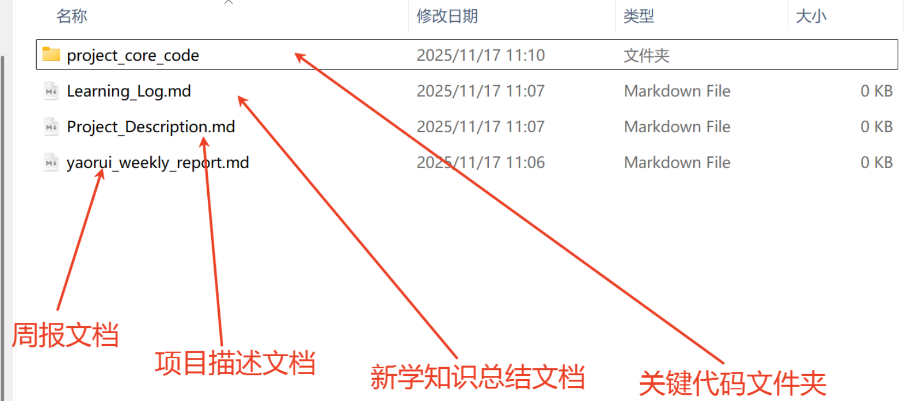

3. 在“project_core_code”文件夹里以"第几周+代码描述.c"创建代码文件。如下图；

​       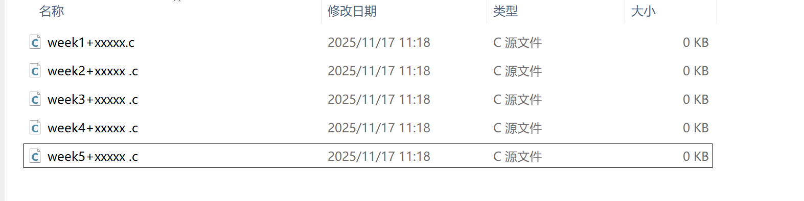

4. 每次提交周报，把最新一周的周报放在周报文档最前面；
4. 如认为有必要创建其他有关文件，可以自行创建。

**模板：**

# 第xx周周报：2025.xx.xx-2025.xx.xx

## 一、本周项目完成内容和新学知识

备注：完成哪部分写哪部分（比如：这周重点推进新知识的学习，那么更新第三点即可），没有内容数量要求，体现完成内容部分

### 1.目前的进度(包括实现的功能和环境搭建等)

（1）实现了 STM32 按键长短按的准确判断

（2）...........

（3）...........

（附关键代码块，少量代码）

### 2.遇到的问题以及解决方法

描述：在临界区内等待信号量 API 返回异常的问题
解决：

  (1) 自己解决的步骤、方法或者代码改进（附加问题代码块或描述，解决后代码块或者解决描述）

  (2) 引用别人方法解决（附博客/帖子/视频/链接，或文档名称）

  (3) 无论问题难度大小，都需要记录

### 3.新学习到的知识点

如：理解掌握了 FreeRTOS 中的信号量机制等
（附文档总结）

## 二、下周安排

备注：简单计划，合理就行
完成某个功能/理解掌握某部分知识

### 三、项目源码更新说明

备注：如果有更新，加入这部分，顺便更新项目说明文档 Project_Description.md
源码可以按部分加简单的说明注释，在难点或者关键点需要加更详细的说明

# Part2：Git 使用

备注：如何使用 ssh 与 github 进行连接：[Github配置ssh key的步骤（大白话+包含原理解释）_github生成ssh key-CSDN博客](https://blog.csdn.net/weixin_42310154/article/details/118340458)

## 一、从零开始在本地搭建好自己的仓库

### 1. 步骤1：克隆远程到本地

(1) 在 D 盘创建一个文件夹专门用于克隆远程仓库；

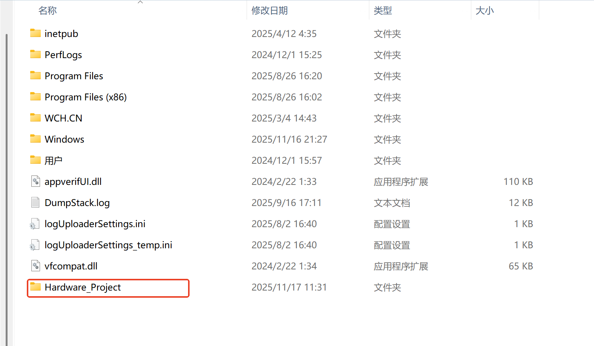

(2) 进入此文件夹，并且打开 git 终端；

(3) 在远程仓库中复制仓库链接；

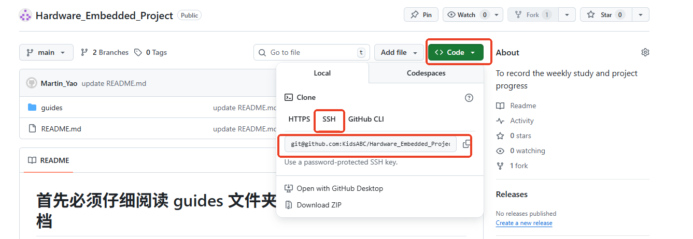

  (4) 使用 “git clone 仓库链接” 命令把远程仓库克隆到本地；

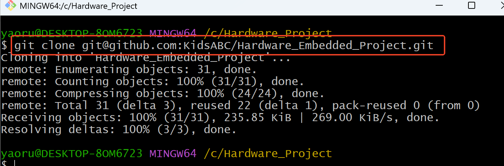

 (5) 随后就可以看见克隆到本地的远程仓库文件夹，进入克隆下来的文件夹，要在该文件夹里进行操作；

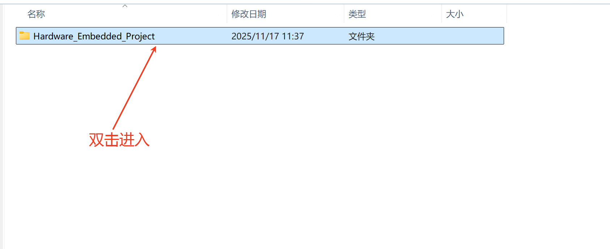

## 2. 步骤2：创建自己的分支并推送到远程仓库

注意：！！！！！！禁止在 main 主分支里修改文件进行推送，必须在各自的分支中进行修改提交！！！！！！！！！！！！！

(1) 先使用 "git checkout -b 分支名" 的命令在本地创建自己的分支，分支名用自己的名字拼音命名，比如："git checkout -b yaorui" 这样就从主分支切换到了新的分支，新分支名叫 yaorui；

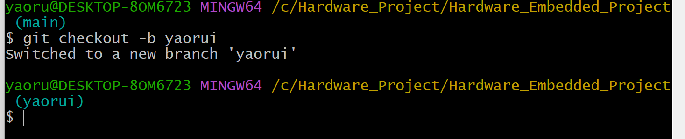

(2) 使用 "git push origin -u 分支名" 命令把本地创建的新分支推送到远程仓库，这样本地分支就和远程仓库分支关联起来了。比如："git push origin -u yaorui" 这样就把刚刚创建好的 yaorui 分支推送到了远程仓库；

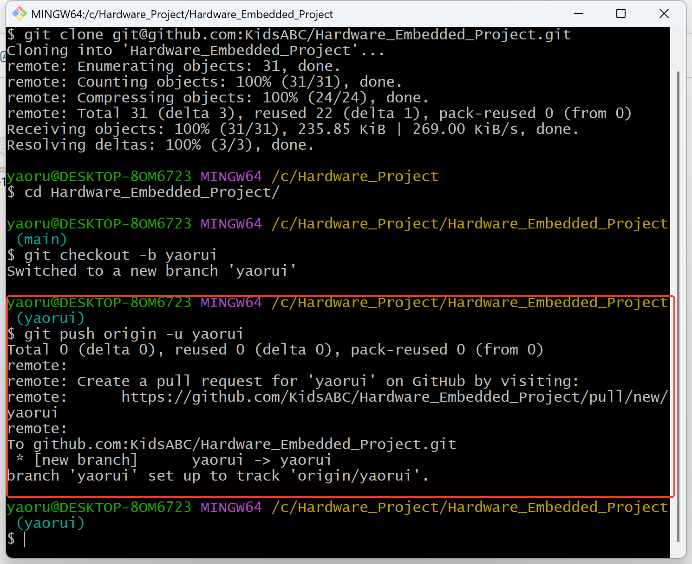

(3) 查看远程仓库就可以看到你的分支，以后所有操作就在你的分支上进行，不要动 main 主分支；

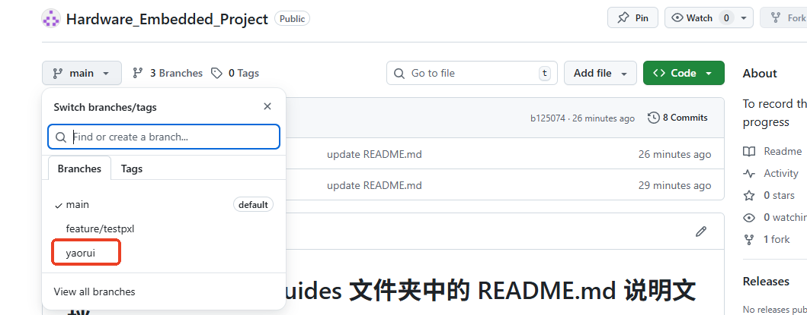

### 3. 步骤3：在分支上创建周报相关文档并推送到远程仓库

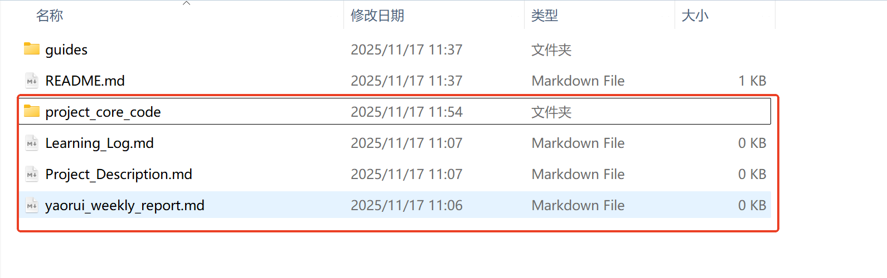

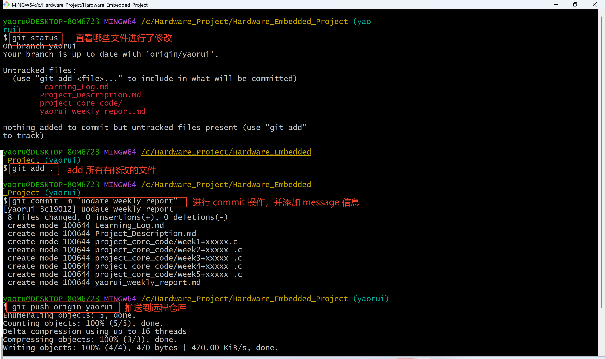

可以把 yaorui 分支改成你自己的分支名

这样在远程仓库就可以看到你提交上去的文档和代码

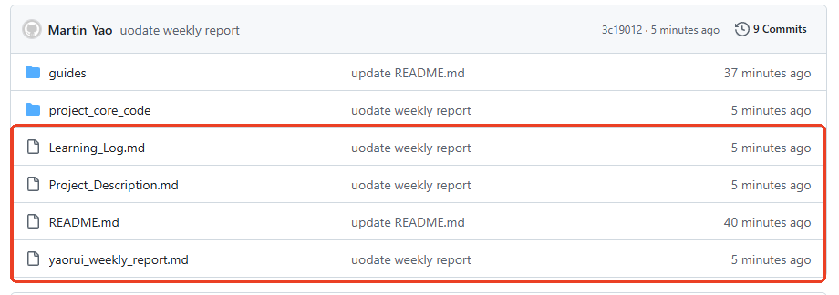

之后就在自己的分支里修改和添加相关的的文档和代码
